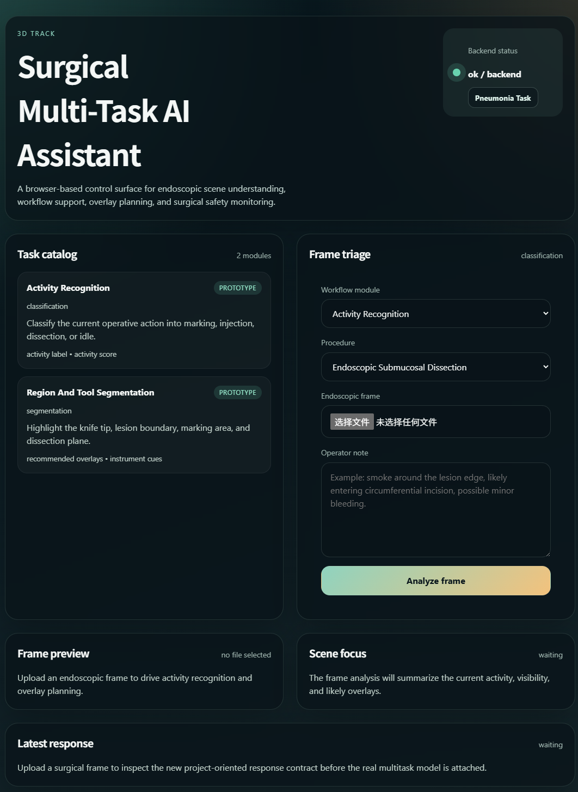
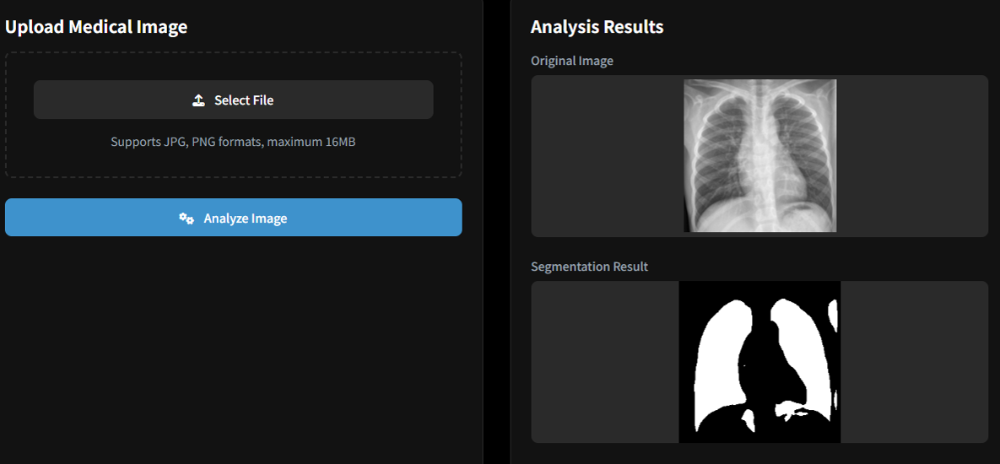

## 🤖 Built With

This project was developed using [Claude Code](https://claude.ai/code) with the Claude Opus 4.6 model via vibe coding.

---

# Surgical Multi-Task AI Assistant

A web-based platform for surgical multi-task scene understanding and medical image analysis.
The system integrates multiple AI modules for endoscopic analysis and pneumonia detection, with an interactive interface for real-time inference.

---

## 🖥️ Frontend Preview

|              Web Interface              |
| :-------------------------------------: |
|  |

---

## 🚀 Features

* Multi-task surgical scene understanding (EndoARSS)
* Pneumonia detection via image segmentation & classification (multilix)
* Web-based interactive interface
* Backend–frontend separation (FastAPI + React)

---

## 🧠 Modules

### EndoARSS

Endoscopic multi-task analysis module for surgical scene understanding, including activity recognition, detection, and segmentation.

|                Detection & Recognition               |                 Segmentation                 |
| :--------------------------------------------------: | :------------------------------------------: |
|  |  |

---

### multilix

Medical image analysis module for pneumonia detection, supporting both image segmentation and classification tasks. Built with PyTorch and Flask.

|                Pneumonia Detection               |
| :----------------------------------------------: |
|  |

---

## 🛠️ Installation

### 1. Clone this repository

```bash
git clone https://github.com/Nijikasuki/Surgical_Multi-Task_AI_Assistant.git
cd Surgical_Multi-Task_AI_Assistant
```

---

### 2. Install dependencies

```bash
pip install -r requirements.txt
```

This installs all packages required by the backend (FastAPI), the multilix module (Flask + PyTorch), and shared utilities.

---

### 3. Set up EndoARSS model resources

```bash
git clone https://github.com/gkw0010/EndoARSS.git
```

Place or configure the model files according to your backend settings.

---

### 4. Set up multilix model

Ensure the pre-trained model file is placed at:

```
modules/multilix/app/model/multimix_trained_model.pth
```

---

## ▶️ Usage

### One-click startup (Windows)

Double-click `start.bat` in the project root. It will open three separate terminal windows and start all services automatically.

| Service | URL |
| :------ | :-- |
| Backend (FastAPI) | http://127.0.0.1:8000 |
| Frontend (React) | http://127.0.0.1:5173 |
| Multilix (Flask) | http://127.0.0.1:5001 |

---

### Start manually

#### Backend

```bash
python main.py
```

Runs at: http://127.0.0.1:8000 — API docs available at http://127.0.0.1:8000/docs

---

#### Frontend

```bash
cd frontend
npm install
npm run dev
```

Runs at: http://127.0.0.1:5173

---

#### Multilix module (standalone)

A standalone web interface for pneumonia detection. Upload a chest X-ray image to get:

* **Segmentation mask** — highlights the lesion region
* **Classification result** — NORMAL or PNEUMONIA

```bash
cd modules/multilix
python app_with_model_and_loading.py
```

Runs at: http://127.0.0.1:5001

Requires the pre-trained model at `modules/multilix/app/model/multimix_trained_model.pth`.

---

## 🔗 System Overview

```
Frontend (React)
    └── Backend (FastAPI)
            ├── EndoARSS  →  Surgical scene understanding
            └── multilix  →  Pneumonia detection
```

---

## 📌 Notes

* Ensure backend is running before frontend
* GPU is recommended for better performance
* Configure model paths if needed


---

## 📄 License

This project is for academic and research purposes only.
