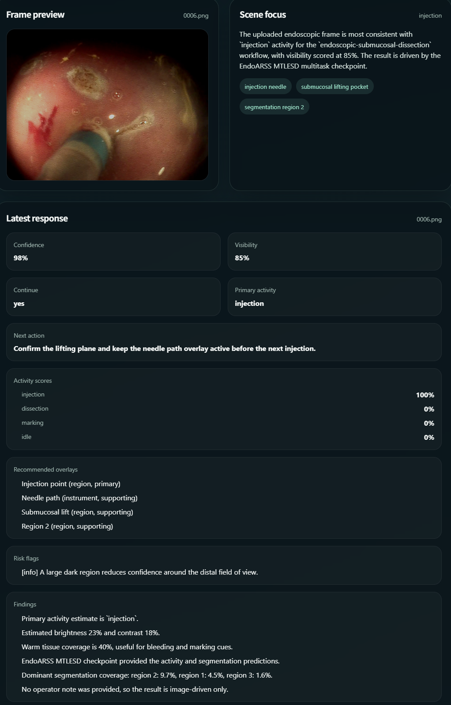
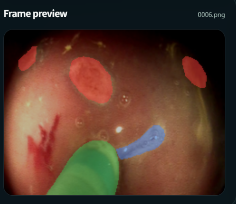

# Surgical Multi-Task AI Assistant

A web-based platform for surgical multi-task scene understanding and medical image analysis.  
The system integrates multiple AI modules for endoscopic analysis and pneumonia detection, with an interactive interface for real-time inference.

---

## 🚀 Features

- Multi-task surgical scene understanding (EndoARSS)
- Pneumonia detection via image segmentation & classification (multilix)
- Web-based interactive interface
- Backend–frontend separation (FastAPI + React)

---

## 🧠 Modules

### EndoARSS
Endoscopic multi-task analysis module for surgical scene understanding, including activity recognition, detection, and segmentation.

| Detection & Recognition | Segmentation |
|:-----------------------:|:------------:|
|  |  |

---

### multilix
Medical image analysis module for pneumonia detection, supporting both image segmentation and classification tasks. Built with PyTorch and Flask.

| Pneumonia Detection |
|:-------------------:|
|  |

---

## 🛠️ Installation

### 1. Clone this repository

```bash
git clone https://github.com/Nijikasuki/Surgical_Multi-Task_AI_Assistant.git
cd Surgical_Multi-Task_AI_Assistant
```

---

### 2. Install backend dependencies

```bash
pip install -r backend/requirements.txt
```

---

### 3. Set up EndoARSS model resources

```bash
git clone https://github.com/gkw0010/EndoARSS.git
```

Place or configure the model files according to your backend settings.

---

### 4. Set up multilix environment

```bash
cd modules/multilix
pip install flask torch torchvision opencv-python numpy pillow
```

Ensure the pre-trained model file is placed at `modules/multilix/app/model/multimix_trained_model.pth`.

---

## ▶️ Usage

### Start main backend

```bash
python main.py
```

Backend runs at: http://127.0.0.1:8000

---

### Start frontend

```bash
cd frontend
npm install
npm run dev
```

Frontend runs at: http://127.0.0.1:5173

---

### Start multilix module (standalone)

```bash
cd modules/multilix
python app_with_model_and_loading.py
```

Runs at: http://127.0.0.1:5001

---

## 🔗 System Overview

```
Frontend (React)
    └── Backend (FastAPI)
            ├── EndoARSS  →  Surgical scene understanding
            └── multilix  →  Pneumonia detection
```

---

## 📌 Notes

- Ensure backend is running before frontend
- GPU is recommended for better performance
- Configure model paths if needed

---


## 📄 License

This project is for academic and research purposes only.
